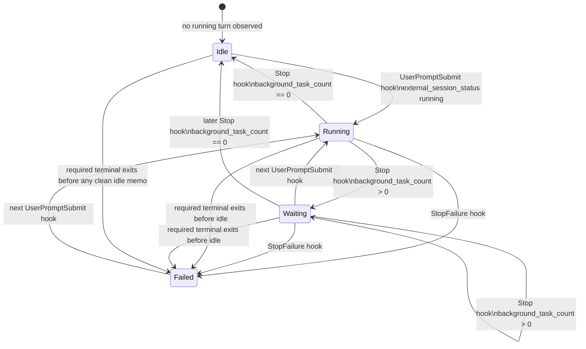
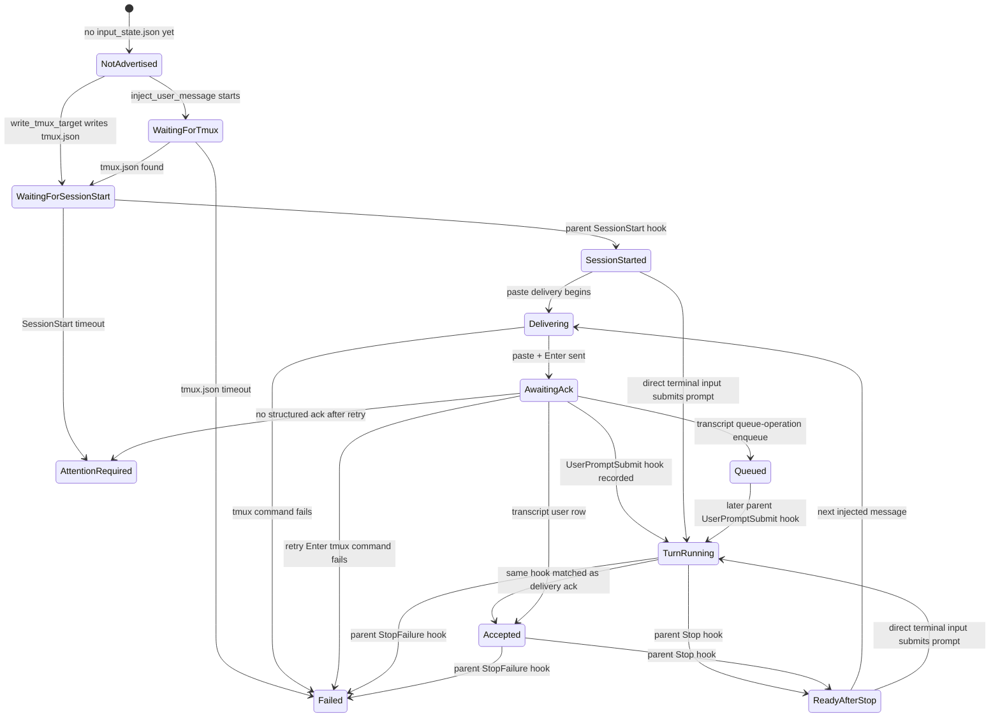

# Claude Native Runner State

Claude native has two separate state surfaces:

- Public Omnigent `session.status` is a coarse lifecycle signal for the web UI
  and sub-agent wakeups. It uses only `idle`, `running`, `waiting`, and `failed`.
- Bridge input state is an internal Claude-native driver signal recorded in
  `input_state.json`. It tracks startup/readiness/delivery edges such as
  `waiting_for_session_start`, `awaiting_ack`, and `attention_required`.

Do not treat public `idle` as "Claude is ready for input." A new session can be
publicly idle simply because Omnigent has not observed a running Claude turn yet.
The bridge still waits for `tmux.json`, parent `SessionStart`, and a structured
delivery acknowledgement before it considers an injected message accepted.

## Public Session Status

Claude native public busy state is driven by Claude Code hook events, not by tmux
pane diffs. The tmux watcher still emits terminal activity pulses and detects
terminal exit, but pane output does not publish `session.status` for Claude
native.

## Transition Sources

| Source | Public transition | Details |
| --- | --- | --- |
| `UserPromptSubmit` hook | `idle` / `waiting` / `failed` to `running` | Posted as `external_session_status: running` without `response_id` or `background_task_count`. This opens the session-level busy state. |
| First assistant transcript output | stays `running` | Posts an id-bearing `external_session_status: running` with `response_id`. This opens the web `activeResponse`; it is not the source of session readiness. |
| `Stop` hook with no running background tasks | `running` / `waiting` to `idle` | Posted as `external_session_status: idle` with `background_task_count: 0`, plus `response_id` when known. This closes the active response and clears any shell tally. |
| `Stop` hook with running background tasks | `running` / `waiting` to `waiting` | Posted as `external_session_status: waiting` with a positive `background_task_count`, plus `response_id` when known. The model turn is done, but background shells remain visible. |
| `StopFailure` hook | `running` / `waiting` to `failed` | Posted as `external_session_status: failed`, plus `response_id` when known. Server-side failed status remains sticky until a later `running` edge. |
| Required Claude terminal exit | clean release or `failed` | Exit after the latest observed status memo is `idle` is clean. Exit while the memo is `running` / `waiting`, or before any clean idle memo, is treated as a mid-turn failure. |

## Non-Transitions

| Source | Behavior |
| --- | --- |
| tmux pane activity | Emits `session.terminal.activity` only. It lights the terminal active badge but does not change Claude `session.status`. |
| runner message dispatch | Calls `note_session_turn_started()` for exit classification only. It does not publish Claude `session.status`; the hook forwarder owns that. |
| interrupt request | Sends Escape to Claude Code and publishes no status. The state changes only when Claude later emits `Stop` or `StopFailure`; if no hook arrives, the session stays visibly non-idle. |
| transcript `queue-operation` | Used as input-delivery evidence only. It is not a lifecycle transition. |
| subagent hooks | Ignored for parent busy state. Parent status changes only from parent-session lifecycle hooks. |

## Bridge Input State

The bridge writes its last input-readiness/delivery transition to
`input_state.json` and exposes it through `read_claude_input_state()`. This state
is diagnostic and gating-oriented; it is not emitted as public `session.status`.

## Input Transitions

| State | Entered when | Why it exists |
| --- | --- | --- |
| `not_advertised` | `input_state.json` is missing | No bridge readiness information exists yet. |
| `waiting_for_tmux` | `inject_user_message()` starts before `tmux.json` is found | Prevents typing before the runner has advertised the Claude pane. |
| `waiting_for_session_start` | `tmux.json` is written or found | The pane exists, but Claude has not yet reported a parent interactive session. |
| `session_started` | A parent `SessionStart` hook is observed, or the injection gate finds prior parent session state | Lower-bound structured readiness. This still does not prove no startup dialog is on screen. |
| `delivering` | The bridge starts clearing/pasting into tmux | A message is being written to the TUI. |
| `awaiting_ack` | Paste and submit `Enter` have been sent | The bridge is waiting for `UserPromptSubmit`, a transcript user row, or a native queue row. |
| `accepted` | `UserPromptSubmit` or a transcript user row matches the exact prompt | Claude accepted the injected prompt as user input. |
| `queued` | A transcript `queue-operation` enqueue row matches the exact prompt | Claude accepted the prompt into its native queue while another turn was running. |
| `turn_running` | A parent `UserPromptSubmit` hook is recorded | Claude has started processing a user prompt. |
| `ready_after_stop` | A parent `Stop` hook is recorded | The foreground Claude turn ended; public status may be `idle` or `waiting` depending on background tasks. |
| `attention_required` | Parent `SessionStart` never arrives, or delivery never receives structured ack after retry | Claude likely needs visible terminal attention, such as an auth/trust/onboarding/startup dialog, or the prompt remains in the composer. |
| `failed` | tmux delivery fails or a parent `StopFailure` hook is recorded | The bridge or Claude turn reached a hard failure. |
